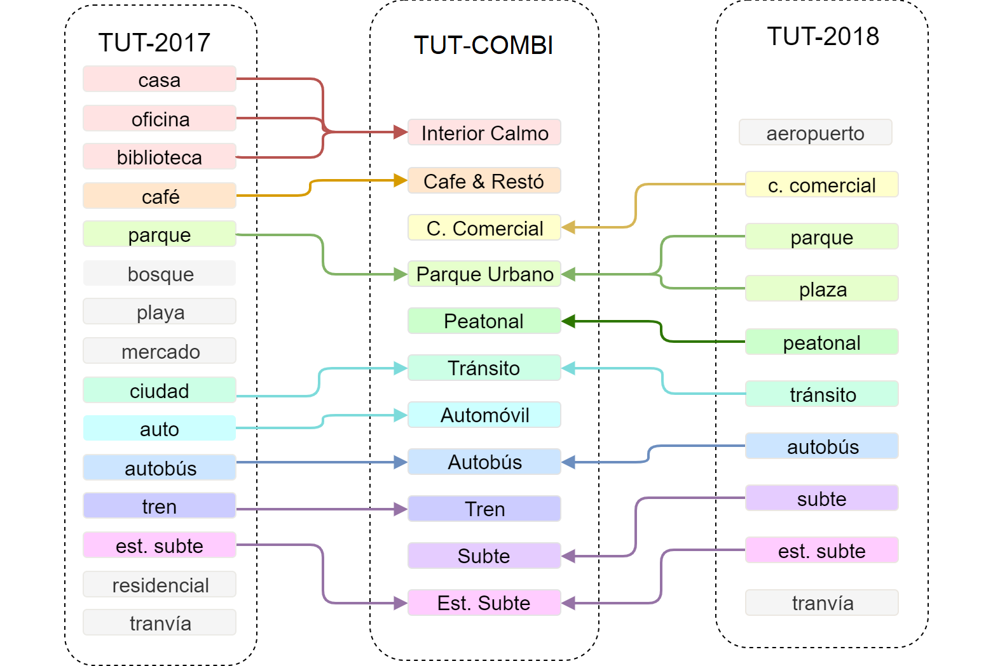
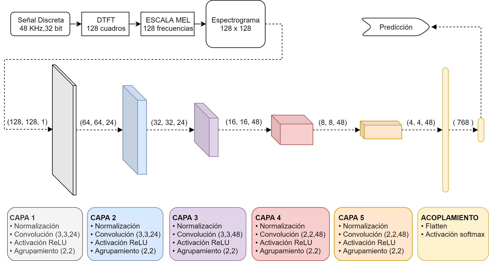
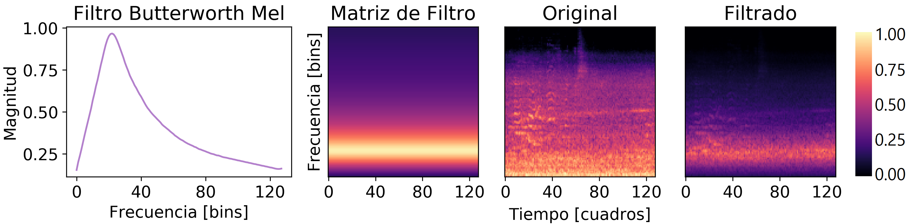
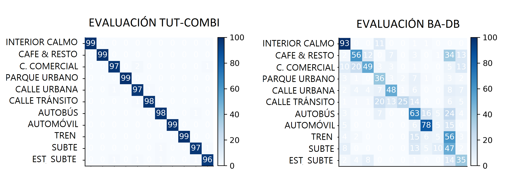

# CNN Model

## Base de datos:
* TUT 2017
* TUT 2018

Se seleccionan y combinan algunas de las clases de las bases de datos para formar una nueva base de datos "COMBI".

## Descriptores
A partir de cada audio se extrae un espectrograma en escala Mel, con 128 componentes de frecuencia.  
Cada espectrograma tiene 128 componentes temporales que representan 2.7 segundos de audio.  
El espectrograma se obtiene calculando una FFT cada 1024 muestras de audio,
utilizando ventanas hanning de 2048 muestras de tamaño.  

## Modelo:
Para el modelo clasificador se utiliza una arquitectura de tipo CNN.

